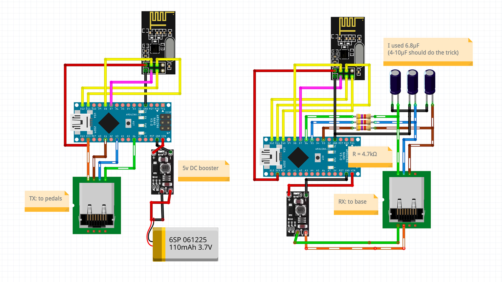
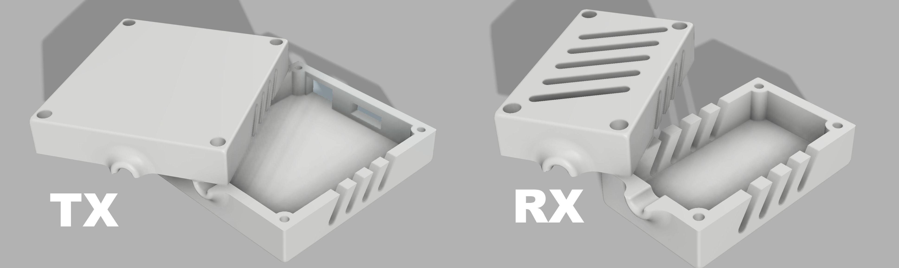
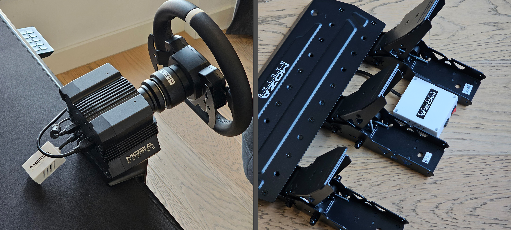

# Wireless Pedals for Moza

Simple project that implements a wireless pedal system for Moza using nRF24L01 modules and Arduino Nano boards. The system consists of a TX that reads pedal inputs and a RX that converts these inputs into signals for the base.

## Features

- Wireless transmission of pedal data (gas, brake, clutch) to base
- Simple signal filtering for smoothness
- Low latency communication

## Hardware Requirements

- 2x Arduino Nano with `nRF24L01` module (or you can get a so-called RF-Nano, which I personally did)
- 1x `RJ45` cable to repurpose for both ends
- At least 1x 3.3V DC-DC booster to 5V
- Power supply or 1S battery with charger
- 3 capacitors in the `4-10μF` range
- 3 resistors in the `4.7-10kΩ` range

## Wiring



## Software Installation

1. Install [PlatformIO](https://platformio.org/) in your preferred IDE
2. Clone this repository
3. Open the project in PlatformIO

## Flashing Instructions

### Using PlatformIO:

1. Connect your Arduino Nano to your computer
2. Open the project in PlatformIO
3. Upload:

   ```bash
   # For RX
   pio run -t upload -e rx

   # For TX
   pio run -t upload -e tx
   ```

### Using Arduino IDE:

1. Install the RF24 library
2. Open the appropriate file:
   - For TX: `src/tx_pedals.cpp`
   - For RX: `src/rx_pedals.cpp`
3. Select "Arduino Nano" as the board
4. Click "Upload"

## Debug Mode

To enable debug output:

1. Add `-DDEBUG` to the `build_flags` in `platformio.ini`
2. Open Serial Monitor at 115200 baud rate (I used [this serial plotter](https://github.com/CieNTi/serial_port_plotter))

## STL

I made a basic case for both TX and RX — just something to keep the boards safe and hold the RJ45 cable in place. The two halves fit together with M3 threaded inserts. You can find STL files in STL folder ([here](assets/stl/))



And thats how it looks IRL



## Notes

I just measured the voltage levels coming from the base to the pedals using a multimeter — turns out it's not some fancy protocol, just regular analog signals.

- Gas: 0.92 - 2.24 V
- Brake: 0.80 - 2.16 V
- Clutch: 0.72 - 2.16 V

There's a 3.3V power line on the RJ45 and a common ground shared with the pedals. Since the base reads simple analog voltages, I just replicated them using filtered PWM on the receiver side. 

## Possible Improvements

- Ideally, it would be better to use a DAC to generate a proper signal for the base, avoiding noise and the slight delay that can occur with capacitor-based solutions. However, most available DAC modules only support two I2C addresses with only 1 channel, and bare modules can be tricky to wire up. Still, this approach could provide a higher quality and more reliable result.

- Somehow make power consumption better